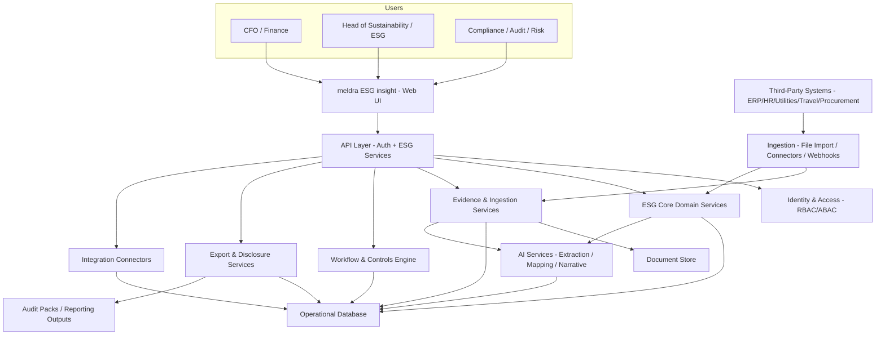

# meldra ESG insight — Proposed Architecture (ESG v2)

## Goals

- Framework-agnostic ESG reporting (ESRS/CSRD, GRI, SASB, custom KPIs)
- Assurance-ready governance (evidence, approvals, waivers, audit trails)
- Workflow-driven execution (cross-functional ownership, tasks, SLAs)
- AI-assisted automation with traceability (AI proposes; humans approve)
- Extensible ingestion (files, connectors, webhooks) and exports (audit packs)

## Platform components (generalized)

### Experience layer (UI)

- Web application for ESG data capture, review, dashboards, approvals, exports
- Role-based views
  - CFO/Finance: controls, KPI dashboards, audit packs
  - Sustainability/ESG: frameworks, requirements, disclosures
  - Compliance/Audit/Risk: evidence, approvals, waiver policy, activity logs

### API and orchestration layer

- API layer providing:
  - Authentication and authorization (RBAC/ABAC)
  - ESG domain services (master data + transaction data)
  - Evidence ingestion services
  - Workflow and controls services
  - Export and disclosure services
  - Integration services (connectors and webhooks)

### ESG data foundation (domain model)

- Context
  - Project/organization
  - Reporting period
  - Site/entity (optional)
- Master data
  - Frameworks
  - Framework requirements
  - Metric definitions (key, name, unit, metadata)
- Transaction data
  - Metric values (per context)
  - Evidence links (citations to source documents)
- Governance
  - Approval records
  - Waiver policy with justification and risk level
  - Activity logs (who changed what, when)

### Evidence and ingestion layer

- Document store for evidence files (PDFs, scans, spreadsheets) with metadata
- Extraction pipeline (OCR/text extraction where needed)
- Validation and normalization:
  - unit normalization
  - date/period parsing
  - site/entity matching
  - duplicate detection

### Workflow and controls layer

- Task engine:
  - assigns work to owners
  - supports due dates and SLAs
  - creates review/approval steps
- Controls enforcement:
  - approval gates
  - evidence-required policy
  - waiver rules (admin-only + justification)

### AI services layer (governed)

- Evidence extraction: proposes metric values with citations
- Import mapping: maps source columns/fields to metric definitions
- Narrative drafting: drafts disclosure text with citations
- Risk/anomaly: flags outliers and recommends checks

## Third-party data injection (how external data enters)

Third-party data can be injected through three primary channels. All three converge into the same governed pipeline: normalize → validate → map → stage → approve.

### 1) File-based import

- CSV/XLSX exports from ERP, utility providers, fleet systems, HR systems
- Recommended flow:
  - upload → schema detection → validation → AI-assisted mapping (optional) → staging → review → approval

### 2) Direct API connectors

- OAuth/API-key based sync from systems like ERP/HRIS/procurement/utilities
- Recommended flow:
  - scheduled sync → transform → staging → review → approval

### 3) Webhooks / event-driven ingestion

- Third-party systems push events (“new invoice”, “new meter reading”)
- Recommended flow:
  - signed webhook → validate payload → store raw → transform → workflow tasks → review → approval

### Governance for injected data

- Authentication: OAuth, API keys, signed webhooks
- Authorization: RBAC/ABAC + separation of duties (optional)
- Lineage: each metric value references source import job / payload / file
- Audit: activity log tracks changes and approvals

## AI-driven automated workflows (evidence-first)

AI can automate workflows by turning evidence into structured suggestions and tasks:

- Evidence upload triggers extraction
- AI returns structured output:
  - suggested metrics + values + units
  - period/site mapping
  - citations (page/excerpt/cell)
  - confidence and recommended validation steps
- Platform converts AI suggestions into tasks:
  - Ops validates source and site mapping
  - Finance validates totals and costs
  - ESG validates factors and disclosures
  - Approver approves once evidence policy is satisfied

## Architecture diagram (Mermaid)

